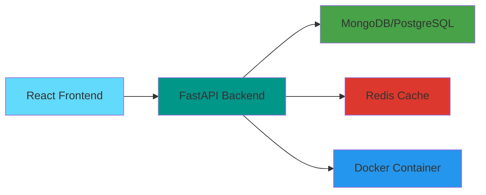

# Sadumina Rathnayaka

**Software Engineering Intern @ Haycarb PLC & Hayleys PLC**  
Building production systems for industrial automation and real-time tracking

---

## Technical Profile

```typescript
const developer = {
  location: "Colombo, Sri Lanka",
  role: "Backend-Focused Full-Stack Developer",
  
  languages: {
    python: "45%",      // FastAPI, Django, Automation
    javascript: "35%",  // React, Node.js, Real-time
    java: "15%",        // Enterprise systems
    typescript: "5%"    // Type-safe apps
  },
  
  specializations: [
    "Real-time WebSocket Systems",
    "Industrial IoT Solutions", 
    "Factory Automation",
    "API Development"
  ]
}
```

## Language Distribution


## Framework Expertise

| Framework | Proficiency | Projects | Use Case |
|-----------|-------------|----------|----------|
| **FastAPI** | ████████░░ 85% | 3 | Backend APIs, Microservices |
| **React** | ████████░░ 80% | 5 | Web UIs, Dashboards |
| **Django Channels** | ███████░░░ 70% | 2 | WebSocket, Real-time |
| **Node.js** | ██████░░░░ 65% | 3 | API Services |
| **Docker** | ██████░░░░ 60% | 4 | Containerization |

## Role Compatibility

```python
# Based on current skills and project portfolio
role_match = {
    "Backend Engineer":           85,  # Strong API & system design
    "Full-Stack Developer":       80,  # React + Python stack
    "Real-Time Systems Engineer": 75,  # WebSocket expertise
    "IoT Developer":              70,  # Industrial automation
    "DevOps Engineer":            50   # Growing Docker skills
}
```

**Best Fit Roles:**
- Junior Backend Engineer (FastAPI/Django focus)
- Full-Stack Developer (Python + React)
- IoT Solutions Developer (Industrial systems)

## Production Systems

**Currently Running at Haycarb PLC:**

```yaml
VehicleMonitoring:
  stack: [React, Node.js, MongoDB]
  users: Factory Operations
  purpose: Real-time gate management
  
FuelTracker:
  stack: [FastAPI, React, Docker]
  users: PD Department  
  purpose: Fuel consumption tracking
  
CarbonXInsight:
  stack: [FastAPI, React]
  users: Sales & Marketing
  purpose: Product pricing analytics
```

## Project Architecture



## Tech Stack

**Backend:** FastAPI • Django • Node.js • Redis  
**Frontend:** React • Next.js • HTML/CSS  
**Database:** MongoDB • PostgreSQL  
**DevOps:** Docker • Git • Azure  
**Protocols:** WebSocket • REST • Pub/Sub

## Contribution Pattern


## Growth Timeline

```
2024 Q1  →  Academic Projects (Java, Web Basics)
2024 Q2  →  FastAPI & React Learning
2024 Q3  →  Haycarb Internship (Production Systems)
2024 Q4  →  Industrial IoT & WebSockets
2025 Q1  →  Advanced Architectures & Cloud
```

## Key Achievements

- ✅ Deployed 3 production systems at Haycarb PLC
- ✅ Built WebSocket architecture from scratch
- ✅ Implemented containerized microservices
- ✅ Real-time vehicle tracking with IoT sensors
- ✅ Grade A on academic team project

## Contact

[](https://www.linkedin.com/in/sadumina-bagya-744792278/)
[](https://v0-unique-portfolio-ojno.vercel.app)
[](https://medium.com/@bagyasadumina)
[](https://www.hackerrank.com/profile/it23394124)

---

> *"I don't follow perfection—I just improve my knowledge"*  
> Currently focused on building real-world systems that solve industrial problems
