<div align="center">


<br>

<!-- Social Badges with Glow Effect -->
<p align="center">
  <a href="https://www.linkedin.com/in/sadumina-bagya-744792278/">
    
  </a>
  <a href="https://medium.com/@bagyasadumina">
    
  </a>
  <a href="https://www.hackerrank.com/profile/it23394124">
    
  </a>
</p>


</div>

---


## 🚀 About Me


```python
class Developer:
    def __init__(self):
        self.name = "Sadumina Bagya"
        self.role = "Full-Stack Developer"
        self.location = "🇱🇰 Colombo, Sri Lanka"
        self.company = "Haycarb PLC / Hayleys PLC"
        self.education = "IT Undergraduate"
        self.passion = "Building Solutions"
        
    def get_current_work(self):
        return {
            "workplace": "Haycarb PLC",
            "position": "Software Engineering Intern",
            "projects": [
                "Vehicle Detection System 🚗",
                "FuelTracker Application ⛽",
                "LogiTrack Platform 📦"
            ]
        }
    
    def get_expertise(self):
        return {
            "backend": ["FastAPI", "Node.js", ".NET"],
            "frontend": ["React", "Next.js"],
            "mobile": ["Kotlin", "Android"],
            "devops": ["Docker", "AWS", "GCP"],
            "focus": ["Cloud Architecture", "AI/ML"]
        }
```

<br clear="right"/>

---


## 🛠️ Tech Arsenal

<details open>
<summary><b>💻 Languages & Core Technologies</b></summary>
<br>

<p align="center">
  
</p>

</details>

<details open>
<summary><b>🎨 Frontend Development</b></summary>
<br>

<p align="center">
  
</p>

</details>

<details open>
<summary><b>⚙️ Backend & APIs</b></summary>
<br>

<p align="center">
  
</p>

<p align="center">
  
  
</p>

</details>

<details open>
<summary><b>🗄️ Databases</b></summary>
<br>

<p align="center">
  
</p>

</details>

<details open>
<summary><b>☁️ DevOps & Cloud</b></summary>
<br>

<p align="center">
  
</p>

<p align="center">
  
  
</p>

</details>

<details open>
<summary><b>🔧 Tools & Platforms</b></summary>
<br>

<p align="center">
  
</p>

<p align="center">
  
  
  
</p>

</details>

<details open>
<summary><b>🚀 Currently Exploring</b></summary>
<br>

<p align="center">
  
</p>

<p align="center">
  
  
</p>

</details>

---


## 💼 Featured Projects

<div align="center">

<table>
<tr>
<td width="50%" valign="top">

### 🚗 Vehicle Detection System


**Full-stack monitoring system for Haycarb PLC**

```yaml
Tech Stack:
  Frontend: React.js
  Backend: FastAPI (Python)
  Database: MongoDB
  DevOps: Docker
  
Features:
  - Real-time vehicle tracking
  - Gate management system
  - Analytics dashboard
  - Automated reporting
```

<p align="center">
  <a href="https://github.com/sadumina/VD-">
    
  </a>
</p>

</td>
<td width="50%" valign="top">

### ⛽ FuelTracker


**Fuel card management for Haycarb PD Team**

```yaml
Tech Stack:
  Backend: FastAPI
  Frontend: React.js
  Container: Docker
  API: OpenAPI Spec
  
Features:
  - Fuel card tracking
  - Travel management
  - Cost analytics
  - Team reporting
```

<p align="center">
  <a href="https://github.com/sadumina/FuelTracker">
    
  </a>
</p>

</td>
</tr>

<tr>
<td width="50%" valign="top">

### 💰 PursePulse


**Personal finance tracker mobile app**

```yaml
Tech Stack:
  Language: Kotlin
  Database: SQLite
  Platform: Android SDK
  
Features:
  - Budget management
  - Expense tracking
  - Financial insights
  - Category-wise reports
```

<p align="center">
  <a href="https://github.com/sadumina/PursePulse">
    
  </a>
</p>

</td>
<td width="50%" valign="top">

### 🔍 Scout Agent AI


**AI-powered market research platform**

```yaml
Tech Stack:
  Backend: Python
  Frontend: React.js
  AI/ML: TensorFlow
  
Features:
  - Market analysis
  - AI predictions
  - Data visualization
  - Automated reports
```

<p align="center">
  <a href="https://github.com/sadumina/Scout_Agent_New-">
    
  </a>
</p>

</td>
</tr>
</table>

</div>

---


## 📊 GitHub Analytics

<div align="center">
  
  
</div>

<div align="center">
  
  
</div>

<br>

<div align="center">
  
</div>

---


## 🎯 Focus Areas & Roadmap

```mermaid
%%{init: {'theme':'dark'}}%%
mindmap
  root((Sadumina<br>Bagya))
    🚀 DevOps
      Kubernetes
      CI/CD Pipelines
      Cloud Native
      Infrastructure as Code
    🤖 AI & ML
      TensorFlow
      Machine Learning
      Deep Learning
      Computer Vision
    💻 Development
      Full-Stack Apps
      Mobile Development
      API Architecture
      Microservices
    ☁️ Cloud
      AWS Services
      Google Cloud
      Serverless
      Cloud Security
    📈 Career
      Haycarb Projects
      Open Source
      Tech Writing
      Community Building
```

<div align="center">



</div>

---


## 🌟 Highlights & Achievements

<div align="center">

<table>
<tr>
<td align="center" width="25%">
<br>
<b>Internship</b><br>
<sub>Haycarb PLC /<br>Hayleys PLC</sub>
</td>
<td align="center" width="25%">
<br>
<b>Projects</b><br>
<sub>25+ Repositories</sub>
</td>
<td align="center" width="25%">
<br>
<b>DevOps</b><br>
<sub>Production Ready</sub>
</td>
<td align="center" width="25%">
<br>
<b>AI/ML</b><br>
<sub>Actively Learning</sub>
</td>
</tr>
</table>

</div>

---


## 📝 Latest Blog Posts

<!-- BLOG-POST-LIST:START -->
<div align="center">

[](https://medium.com/@bagyasadumina)

*Sharing knowledge about Full-Stack Development, DevOps, and AI/ML*

</div>
<!-- BLOG-POST-LIST:END -->

---

<div align="center">


### 💭 Quote of the Day


---


### 📊 Profile Analytics


---

### 💬 Let's Connect & Collaborate!


*"The best way to predict the future is to invent it." - Alan Kay*

<p align="center">
  <a href="https://www.linkedin.com/in/sadumina-bagya-744792278/">
    
  </a>
</p>

</div>


</div>
